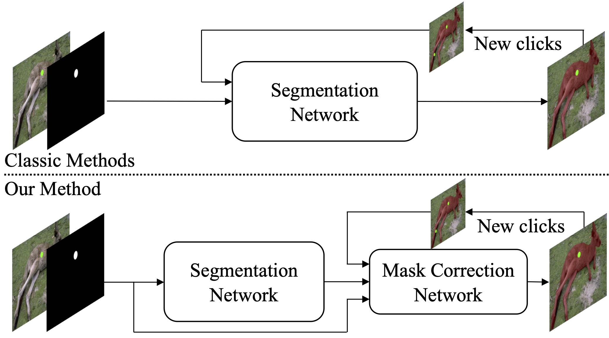

# EMC-Click: Efficient Mask Correction for Click-Based Interactive Image Segmentation (CVPR2023)

The Pytorch code for "[Efficient Mask Correction for Click-Based Interactive Image Segmentation](http://openaccess.thecvf.com//content/CVPR2023/papers/Du_Efficient_Mask_Correction_for_Click-Based_Interactive_Image_Segmentation_CVPR_2023_paper.pdf)" in CVPR2023. 

## Abstract
The goal of click-based interactive image segmentation is to extract target masks with the input of positive/negative clicks. Every time a new click is placed, existing methods run the whole segmentation network to obtain a corrected mask, which is inefficient since several clicks may be needed to reach satisfactory accuracy. To this end, we propose an efficient method to correct the mask with a lightweight mask correction network. The whole network remains a low computational cost from the second click, even if we have a large backbone. However, a simple correction network with limited capacity is not likely to achieve comparable performance with a classic segmentation network. Thus, we propose a click-guided self-attention module and a click-guided correlation module to effectively exploits the click information to boost performance. First, several templates are selected based on the semantic similarity with click features. Then the self-attention module propagates the template information to other pixels, while the correlation module directly uses the templates to obtain target out- lines. With the efficient architecture and two click-guided modules, our method shows preferable performance and efficiency compared to existing methods.

<p align="center">
  
</p>

<br/>
<br/>

## Environment setup
1. Install the requirements by executing
```
pip install -r requirements.txt
```

2. Clone the 2D images of decathlon dataset from my repository in hugging face 'https://huggingface.co/datasets/ineog/Tarea_IA'

Only if you want to check the image extraction from Nifti decathlon dataset you can download the datasets in 'http://medicaldecathlon.com/' and run 
```python extraer_imagenes.py <path_groundtruth> <path_dataset> <organ> 
```
path_groundtruth = path of Nifti groundtruth
path_dataset = directory in you want to save images
organ = choose liver, spleen, lung

The windowing images can be created with normalize_ct_images.py
```python normalize_ct_images.py <path_nifti> <path_to_save> <organ> 
```
if lung images organ = lung, else organ = abdomen
<br/>

## Evaluation
the weigths can be downloaded in https://github.com/feiaxyt/EMC-Click/releases. This proyect use hr32.pth

Edit the paths of the weights and liver, lung and spleen dataset in config.yml 

Run for paper evaluation and obtain masks predictions on the lung, liver, spleen dataset
```bash
python -m torch.distributed.launch --master_port=4321 --nproc_per_node=8 scripts/evaluate_model.py EMC-Click \
    --model_dir='./weights/' \
    --checkpoint=hr32.pth\
    --n-clicks=20 \
    --gpus=0,1,2,3,4,5,6,7 \
    --target-iou=0.9 \
    --thresh=0.5 \
    --eval-mode='emc-click' \
    --datasets=lung, liver, spleen
```

Run for report metrics in Inteligencia Artificial subject
``` python metricas.py <truth_path> <prediction_path> <organ>
```
truth_path = the mask directory where you clone the repository 
organ = choose lung, liver, spleen


<br/>

## Acknowledgement
The code is implemented based on [RITM](https://github.com/SamsungLabs/ritm_interactive_segmentation) and [ClickSEG](https://github.com/XavierCHEN34/ClickSEG). We would like to express our sincere thanks to the contributors.

<br/>

## License
The code is released under the MIT License. It is a short, permissive software license. Basically, you can do whatever you want as long as you include the original copyright and license notice in any copy of the software/source.

<br/>

## Citation

If you find this work is useful for your research, please cite our papers:
```
@inproceedings{emcclick,
  title={Efficient Mask Correction for Click-Based Interactive Image Segmentation},
  author={Du, Fei and Yuan, Jianlong and Wang, Zhibin and Wang, Fan},
  booktitle={CVPR},
  year={2023}
}
```
# prueba
